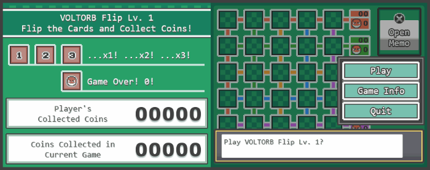

# :zap: Voltorb Flip :boom:

:video_game: A desktop recreation of the [Voltorb Flip minigame](https://bulbapedia.bulbagarden.net/wiki/Voltorb_Flip), 
from Pokemon HeartGold and SoulSilver, built using **JetBrains**
[Compose for Desktop](https://www.jetbrains.com/lp/compose-desktop/).

## :memo: Game details

Gameplay follows the original rules with a few notable deviations from being a faithful recreation:

- Player name cannot be input and the final total coin count is lost when the app closes.
- Key animations have not been implemented, particularly tile flip, tile explosion, coin count increment, and typewriter text effect.
- Riskier tile select logic (i.e. "Is this what you were expecting?") has also been excluded.
- The occasional design choice differs because all UI assets are formed using Canvas, custom svg files (no png assets), or built-in font options.

In addition to the game screen, the three information screens have also been included:

## :microscope: Run tests

Clone the repository then pick an option:

- Open the project in IntelliJ IDEA then choose specific tests using gutter icons or right-click the `desktop/src/jvmTest` folder and
  select `Run 'Tests in 'voltorb-flip.desktop.jvmTest''`

- Open the Gradle toolbar and select `voltorb-flip/Tasks/verification/jvmTest`

## :computer: Run desktop application

Clone the repository then open the project in IntelliJ IDEA and run `Main.kt` from the `desktop/jvmMain` folder